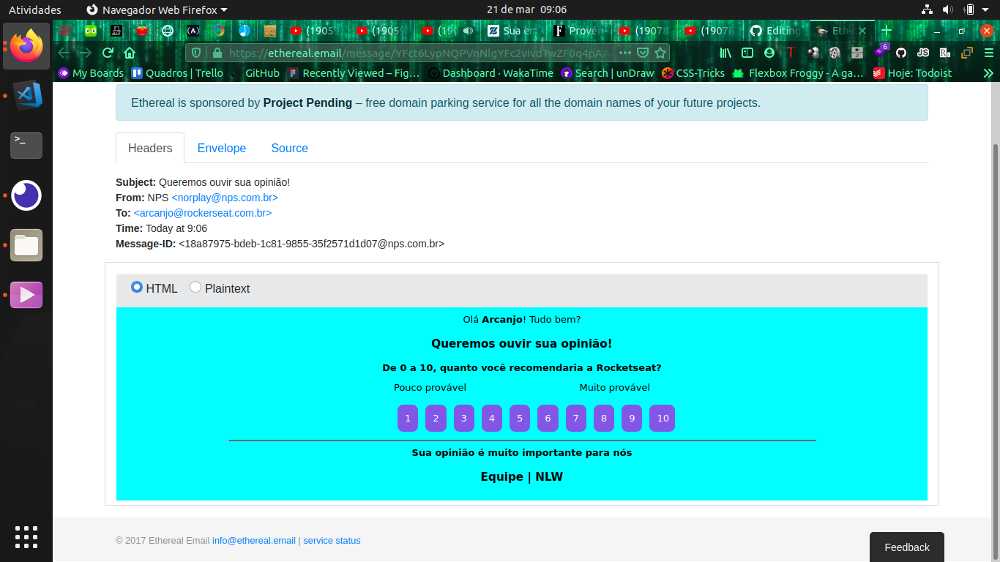
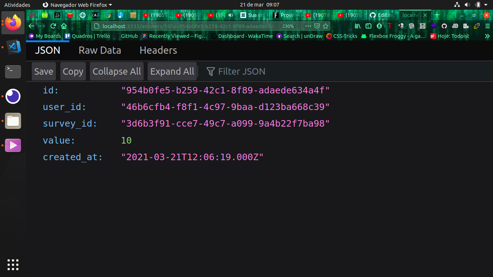
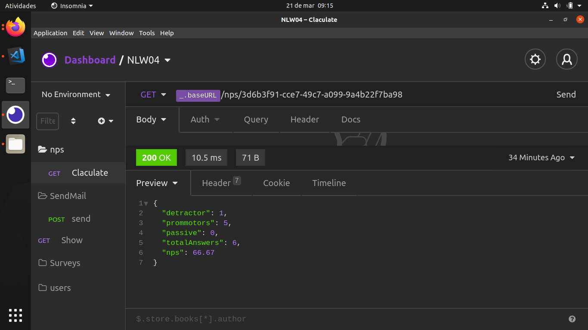

<div align="center">
  <br>
  <p><b>API REST para calculo de NPS</b></p>
  <sub>API-Nodejs | NLW4</sub>
  <br>
</div>


## Menu

- [Sobre](#sobre)
- [Feito com](#feito-com)
- [Para começar](#para-começar)
  - [Instalação ](#instalação)
    - [Pré-requisitos](#pré-requisitos)
    - [Para instalar as  dependências](#Para-instalar-as-dependências)
    - [Para iniciar a aplicação](#Para-iniciar-a-aplicação)
    - [Para rodar os testes](#Para-rodar-os-testes)
- [Algumas imagens](#Algumas-imagens )


## Sobre

Esta é uma API que calcula o NPS(Net Promoter Score) de uma determinada empresa ;

## Feita com

- [Node.js](https://nodejs.org/pt-br/) - JavaScript runtime
- [Express](https://expressjs.com/pt-br/) - O framework web utilizado
- [TypeORM](https://typeorm.io/#/) - Ferramenta de mapeamento objeto relacional disponível como biblioteca para projetos em Javascript e Typescript
- [Yarn](https://yarnpkg.com/) - Gerenciador de pacotes e dependências.
- [sqlite3](https://www.sqlite.org/index.html) - SQLite é uma biblioteca em linguagem C que implementa um mecanismo de banco de dados SQL pequeno, rápido, independente, de alta confiabilidade e recursos completos.
- [nodemailer](https://nodemailer.com/about/) - Nodemailer é um módulo para aplicativos Node.js para permitir um envio de e-mail fácil como bolo.
- [handlebars](https://handlebarsjs.com/) - Handlebars compila modelos em funções JavaScript.
- [ethereal email](https://ethereal.email/) - é um serviço SMTP falso, voltado principalmente para usuários Nodemailer (mas não limitado a).
## Para começar

Com as instruções a seguir você terá uma cópia do projeto rodando em sua máquina local para propósitos de testes e desenvolvimento.

```bash
git clone https://github.com/Arcanjo32cassiel/API-NLW4.git
```

### Instalação

#### Pré-requisitos

- Um gerenciador de dependências - Yarn ou NPM
- [Node.js](https://nodejs.org/pt-br/) versão 14.15.5 ou superior


#### Para instalar as  dependências

```bash
yarn
```
ou

```bash
npm install
```

#### Para iniciar a aplicação


```bash
yarn dev
```
ou

```bash
npm run dev
```


#### Para rodar os testes

Para rodar os testes que esxitem na aplicação criados  com jest, você pode utilizar:

```bash
yarn test
```

ou

```bash
npm run test
```

## 🎥 
## Algumas imagens 


<div display='flex' align='center' >
  <div background-color=' red'>
      

```bash  
      Imagem do email  de pesquisa enviado ao usuário.
```

  </div>
  <div background-color=' red'>
      

```bash  
      Imagem do json do resultado da pesquisa.
```

  </div>
  <div background-color=' red'>
      

```bash  
      Imagem do json do resultado do cáculo de todas as pesquisas.
```

  </div>
</div>